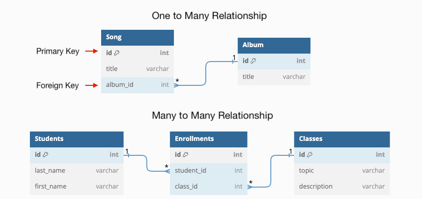
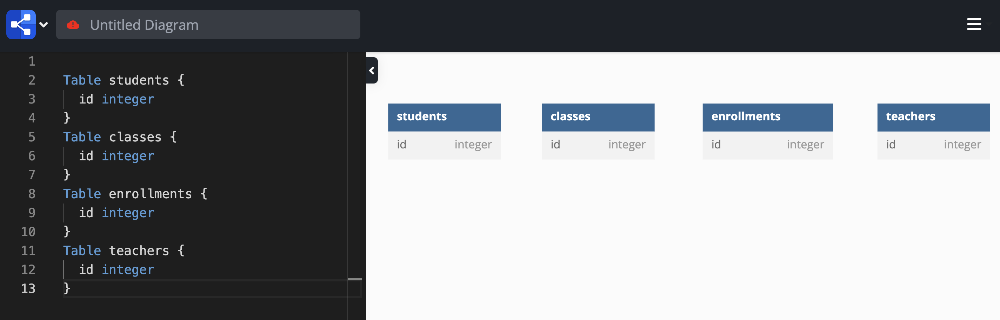
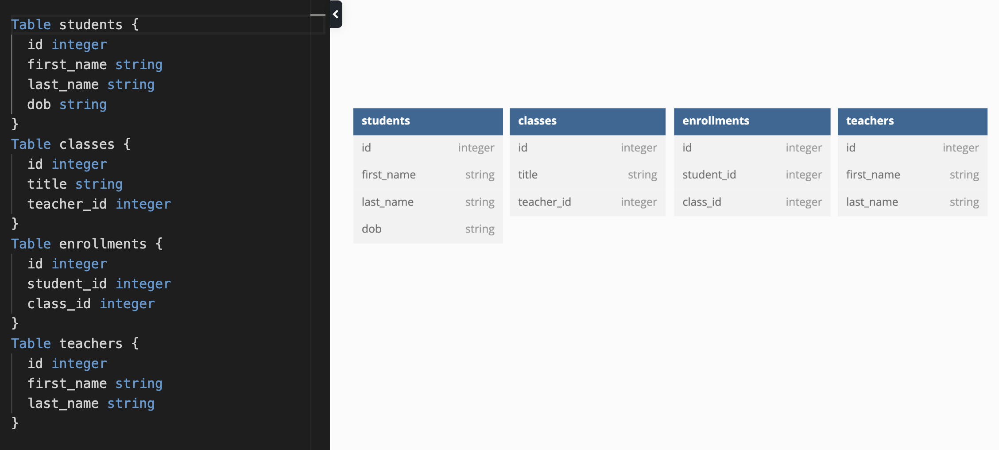
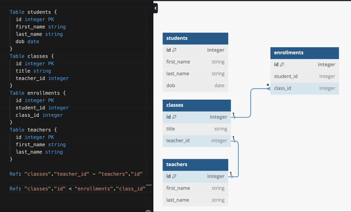

# Database Schema Design + Making ERDs

**Database schema design** is the process of organizing and structuring how data is stored in a database so it can be efficiently stored, retrieved, and updated.

In other words, it is all about designing the tables in our database.

In this lesson, we'll practice designing a database and use dbdiagram.io to create an ERD.

**Table of Contents**:
- [Terms](#terms)
- [Why is schema design important?](#why-is-schema-design-important)
- [Steps For Designing A Database](#steps-for-designing-a-database)
- [Database Markup Language](#database-markup-language)
  - [Step 1 - Identify Tables](#step-1---identify-tables)
  - [Step 2 - Define Columns](#step-2---define-columns)
  - [Step 3 - Determine Relationships](#step-3---determine-relationships)
- [Practice](#practice)
- [Step 4 - Normalizing Tables](#step-4---normalizing-tables)
  - [First Normal Form (1NF)](#first-normal-form-1nf)
  - [Second Normal Form (2NF)](#second-normal-form-2nf)

## Terms

* **Schema Design** - the process of organizing and structuring how data is stored in a database so it can be efficiently stored, retrieved, and updated.
* **ERD (Entity Relationship Diagram)** - a visual representation of the contents of each entity (a.k.a. "table") in your database as well as the relationships between entities.
* **DBML (Database Markup Language)** - a language used to generate ERDs by tools like [dbdiagram.io](https://dbdiagram.io/home)
* **Normal Forms** - a series of guidelines to help achieve a well-structured and efficient database schema.
* **Normalization** - the process of organizing data in a database to eliminate redundancy and inconsistent dependencies.

## Why is schema design important?

A well-designed database schema ensures:
* data consistency
* minimized redundancy
* improved performance

Database schema designs are most often communicated through an **Entity Relationship Diagram**



**<details><summary style="color: purple">Q: Why is having a diagram like this helpful for building software?</summary>**
> A diagram allows all engineers working on a project to have a clear picture of the data required by the project and the relationships between that data. Even if you are working on a solo project, making this kind of plan before starting coding can help you avoid making mistakes along the way! And remember, you can always change things around later.
</details><br>

So, how do we get from an idea to an ERD like this?

## Steps For Designing A Database

Let's say we're designing a database for a school that tracks:
* students at the school
* teachers at the school
* the courses that are available
* which students are taking which courses
* which teachers teach which courses

When designing a database schema, you'll typically follow these steps:

1. Identify tables (a.k.a "entities")
2. Define columns (a.k.a "fields" or "properties")
3. Determine relationships (one-to-many or many-to-many)
4. Normalize (* more on this soon!)

**Q: With your group, take 10 minutes and brainstorm for the first 3 steps for your own project**

## Database Markup Language

**Database Markup Language** was created to standardize the way that database schemas are communicated. When paired with a tool like `https://dbdiagram.io/`, we can quickly define our database schema and create an **Entity Relationship Diagram**.

Visit https://dbdiagram.io/ and clear out the diagram editor. 

### Step 1 - Identify Tables

Okay, let's recall that we're designing a database for a school that tracks:
* students at the school
* teachers at the school
* the courses that are available
* which students are taking which courses
* which teachers teach which courses


**<details><summary style="color: purple">Q: What tables should we use?</summary>**
> I think we could use the following tables: `students`, `classes`, `enrollments` and `teachers`

</details><br>

Using DBML, we can define a table and generate an ERD for that table by simply writing:

```js
Table students {
  id integer
}
```

This creates a table called `students` with a single `id` column.

Below, you can see that I've also created tables for `teachers`, `classes` and `enrollments`




### Step 2 - Define Columns

When defining columns, we should always indicate:
1. the name of the column (typically written in `underscore_case`)
2. the type of the data (`integer`, `string`, `boolean`, `date`, etc...)

For example, using DBML, we might define our `students` table like this:

```js
Table students {
  id integer
  first_name string 
  last_name string 
  dob date
}
````



### Step 3 - Determine Relationships

Determining relationships involves defining _primary keys_, _foreign keys_, and drawing the connections between those primary and foreign keys.

Using DBML we can simply append `PK` to the end of a column to make it a primary key:

```js
Table students {
  id integer PK
  first_name string 
  last_name string 
  dob date
}
```

To define relationships between tables, we can use the syntax

```js
// indicates a 1-1 relationship (each class has only one teacher)
Ref: "classes"."teacher_id" - "teachers"."id"

// indicates a 1-many relationship (each class can have many enrollments)
Ref: "classes"."id" < "enrollments"."class_id"
```

* The "bigger" side of the `<` represents the "many" side of the relationship

Or, using the dbdiagram.io tool, we can click and drag to draw connections between the tables:



Notice the lines drawn between tables are also labeled:
* The `1` indicates the "one" side of a "one-to-" relationship
* The `*` indicates the "many" side of a "many-to-" relationship

In the end, our DBML for this database schema looks like this:

```js
Table students {
  id integer PK
  first_name string 
  last_name string 
  dob date
}
Table classes {
  id integer PK
  title string 
  teacher_id integer
}
Table enrollments {
  id integer PK
  student_id integer
  class_id integer 
}
Table teachers {
  id integer PK
  first_name string 
  last_name string 
}

Ref: "classes"."teacher_id" - "teachers"."id"

Ref: "classes"."id" < "enrollments"."class_id"

Ref: "students"."id" < "enrollments"."id"
```

## Practice

In groups, use `dbdiagram.io` to design a database schema for your application. 

If you haven't yet decided on an application, here are a few ideas that you can start with:
* An online store that sells laptops.
* A photo-sharing application with commenting features (Instagram).
* An online library catalog.
* A restaurant reservation system.
* An concert management system.
* A hotel booking system.

## Step 4 - Normalizing Tables

Database normalization aims to ensure that our database **minimizes redundancy** (no duplicate data) and maintains **data integrity** (the data is accurate and complete).

To do this step, we need to understand the **normal forms**: a series of guidelines to help achieve a well-structured and efficient database schema.

Normalization is the process of making sure our database adheres to these guidelines.

There are many normal forms but the first two can get us quite far.

### First Normal Form (1NF)

A table complies with the first normal form if it satisfies the following conditions:
* All columns contain atomic values (i.e., each value is indivisible).
* Each column has a unique name.
* The order in which data is stored does not matter.

1NF helps eliminate duplicate data by ensuring that each attribute has a single, indivisible value.

For example, this table does not comply with the 1NF because the `products` column contains multiple values:

| order_id | customer_name | products                |
| -------- | ------------- | ----------------------- |
| 1        | Avery         | Laptop, Mouse, Keyboard |
| 2        | Blake         | Laptop, Monitor         |
| 3        | Charles       | Monitor, Trackpad       |

This leads to several problems:

* **Data Redundancy:** The same product is repeated multiple times across different rows, leading to unnecessary duplication of data.
* **Data Inconsistency:** If a product name needs to be updated, it must be done in multiple places, which can lead to inconsistencies if not done correctly.
* **Querying and Updating Challenges:** Performing queries or updates on this data structure can be difficult and inefficient. For example, it is cumbersome to find all customers who ordered a specific product or to add or remove a product for a customer.

To fix it, we can make

| order_id | customer_name | product  |
| -------- | ------------- | -------- |
| 1        | Avery         | Laptop   |
| 1        | Avery         | Mouse    |
| 1        | Avery         | Keyboard |
| 2        | Blake         | Laptop   |
| 2        | Blake         | Monitor  |
| 3        | Charles       | Monitor  |
| 3        | Charles       | Trackpad |

**Q: How do you know that the table below is NOT in the first normal form? How would you fix it?**

| student_id | student_name | courses                       |
| ---------- | ------------ | ----------------------------- |
| 1          | Alice        | Math, Science, History        |
| 2          | Bob          | Science, English, Mathematics |
| 3          | Carol        | History, Math, English        |

<details><summary>Solution</summary>

> The `courses` column contains multiple values for each student, violating the 1NF rule of having atomic values in each column. 
>
> **Solution:** Create a new table with a separate row for each enrollment. Notice how we needed a new piece of data to uniquely identify each row: `enrollment_id` 
>
> | enrollment_id | student_id |	student_name |	course |
> | - | - | - | - |
> | 1 | 1 |	Alice |	Math |
> | 2 | 1 |	Alice |	Science |
> | 3 | 1 |	Alice |	History |
> | 4 | 2 |	Bob |	Science |
> | 5 | 2 |	Bob |	English |
> | 6 | 2 |	Bob |	Mathematics |
> | 7 | 3 |	Carol |	History |
> | 8 | 3 |	Carol |	Math |
> | 9 | 3 |	Carol |	English |

</details>

### Second Normal Form (2NF)

A table complies with  2NF if it meets the following criteria:
* It is already in 1NF.
* All non-key columns are fully dependent on the primary key (i.e., there are no partial dependencies).

2NF helps remove redundancy by ensuring that each non-key attribute is fully dependent on the primary key. This prevents attributes from being repeated across multiple rows.

Take a look at this table `order_details` which shows the relationships between an order placed by a customer and the products in each order.

This is NOT compliant with the second normal form:

| id  | order_id | product_id | product_name | customer_id | customer_name |
| --- | -------- | ---------- | ------------ | ----------- | ------------- |
| 1   | 1        | 1          | Laptop       | 1           | Avery         |
| 2   | 1        | 2          | Monitor      | 1           | Avery         |
| 3   | 2        | 1          | Laptop       | 2           | Blake         |
| 4   | 3        | 3          | Trackpad     | 3           | Charles       |

In this table, the following partial dependencies exist:
* `product_name` depends on `product_id`, not on the primary `id` key
* `customer_name` depends on `customer_id`, not on the primary `id` key

In other words, we don't need both the `product_id` and the `product_name` to identify a product. We should rely exclusively on the `product_id` to uniquely identify a product.

To reach 2NF, we must eliminate partial dependencies by removing these partial dependencies:

1. The `products` table ties each `product.id` to unique `product.name`

    | id  | name     |
    | --- | -------- |
    | 1   | Laptop   |
    | 2   | Monitor  |
    | 3   | Trackpad |

2. The `customers` table ties each `customer.id` to a unique `customer.name`

    | id  | name    |
    | --- | ------- |
    | 1   | Avery   |
    | 2   | Blake   |
    | 3   | Charles |

3. The `orders` table ties which `customer.id` placed which `order.id` 
    | id  | customer_id |
    | --- | ----------- |
    | 1   | 1           |
    | 2   | 2           |
    | 3   | 3           |

4. The `order_items` "junction/association" table tracks which products are associated with each order:

    | id  | order_id | product_id |
    | --- | -------- | ---------- |
    | 1   | 1        | 1          |
    | 2   | 1        | 2          |
    | 3   | 2        | 1          |
    | 4   | 3        | 3          |

**Q: How do you know that the table below is NOT in 2NF? How would you fix it?** 

| enrollment_id | student_id | student_name | course      |
| ------------- | ---------- | ------------ | ----------- |
| 1             | 1          | Alice        | Math        |
| 2             | 1          | Alice        | Science     |
| 3             | 1          | Alice        | History     |
| 4             | 2          | Bob          | Science     |
| 5             | 2          | Bob          | English     |
| 6             | 2          | Bob          | Mathematics |
| 7             | 3          | Carol        | History     |
| 8             | 3          | Carol        | Math        |
| 9             | 3          | Carol        | English     |

<details><summary>Solution</summary>

> The table is NOT in 2NF because the `student_name` column is dependent on the `student_id` column, which is not the primary key.
> 
> To remove this partial dependency, we can make separate tables:
> 1. The `students` table:
> 
>     | student_id |	student_name |
>     | - | - |
>     | 1 |	Alice |
>     | 2 |	Bob |
>     | 3 |	Carol |
> 
> 2. The `enrollments` table:
>     | id | student_id  |	course |
>     | - | -  | - |
>     | 1 | 1  |	Math |
>     | 2 | 1  |	Science |
>     | 3 | 1  |	History |
>     | 4 | 2  |	Science |
>     | 5 | 2  |	English |
>     | 6 | 2  |	Mathematics |
>     | 7 | 3  |	History |
>     | 8 | 3  |	Math |
>     | 9 | 3  |	English |

</details>